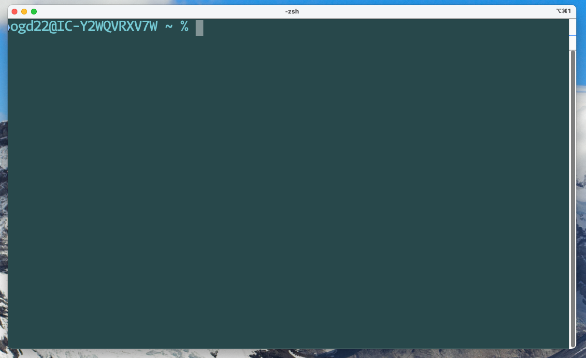

# The command line
Text as both input and output—a product of early computing infrastructure.

## Introduction
A *shell* provides the command line interface to launch *commands*, and basic tools like passing data between commands or wildcard matching for filenames.
The shell passes these commands to the *kernel*, which manages the computer's resources and command execution.
The command line is still the primary way to access shared computing resources (like the HPC or the Group computers) or cloud computing resorces/containers (which are common in industry), and can be an effective way to work on your own machines.

Linux and macOS come with a "Unix-style shell"—this is the kind of shell that you'll find on remote computers too.
Windows comes with its own "DOS-style" command line interface, but can now run a "subsystem for Linux" which provides a Unix-style shell.

## Using commands
The terminal will look something like this:


The text is the *prompt*, here it contains the username, hostname, current directory, and `%`.
The `%` character is just a marker to indicate the point at which you can begin to type.
The prompt can be customised, which is one of many ways you can customise you command line interface.

Commands can be run after the prompt.
The command consists of the programme name, followed by any **options** and then any **arguments**.
Most commands look something like this:
```bash
command -options arguments
```

Most of the time, options are specified by a single character preceded by a dash, for example `-v`.
Many commands have *long form* versions of the options too—which have two dashes, for example `--verbose`.
You can also chain the short forms for many commands, for example `-lah` is equivalent to `-l -a -h`.

For the "shell builtin" commands, you can use the command `help` to get some information about what options you might try.
The tool [`tldr`](https://tldr.sh/) is worth trying out if you're spending some serious time getting to know the command line—it provides clear documentation pages into a nice format with examples.
The hardcore documentation tool is `man`—this can be used to explore

## Navigating the file system
The most basic commands give you a way to interact with the file system:
- [`pwd`](https://tldr.inbrowser.app/pages/common/pwd) Display the name of the current "working directory".
- [`cd`](https://tldr.inbrowser.app/pages/common/cd) Change the current working directory.
- [`ls`](https://tldr.inbrowser.app/pages/common/ls) List the files in the current working directory.

You can manipulate files:
- [`mv`](https://tldr.inbrowser.app/pages/common/mv) Move or rename a file.
- [`cp`](https://tldr.inbrowser.app/pages/common/cp) Copy a file.
- [`rm`](https://tldr.inbrowser.app/pages/common/rm) Delete files. (Be careful! There's no "Bin" to recover files, and wildcards can cause lots of files to be lost).

And directories:
- [`rmdir`](https://tldr.inbrowser.app/pages/common/rmdir) Delete directories.
- [`mkdir`](https://tldr.inbrowser.app/pages/common/mkdir) Make a directory.

## Creating, viewing, and editing files
You can use *redirection* to send command output to a file.
This is done by adding `> path/to/file` after a command.
This overwrites the file, using two `>` symbols (i.e. `>> path/to/file`) will append to an existing file.

Other commands useful for file creation are:
- [`touch`](https://tldr.inbrowser.app/pages/common/touch) Create an empty file.
- [`echo`](https://tldr.inbrowser.app/pages/common/echo) Displays its argument. Can be useful when applied in conjuction with redirection.

Files can be viewed by displaying their contents:
- [`cat`](https://tldr.inbrowser.app/pages/common/cat) Display the contents of a file
or by using a "pager":
- [`less`](https://tldr.inbrowser.app/pages/common/less)

The command line can also be used to lauch editors:
- `nano` A basic text editor
- `vim` A very powerful, but more complicated text editor designed to be super fast when you use the keyboard. (see also it's predecessor `vi` and the newer "neovim").
- `emacs` Another powerful text editor which is widely customisable.
Experienced users will tend to choose one of either `vim` or `emacs` and use it frequently.
You can also install command line interfaces for graphical IDEs (like VS Code) and launch them from the command line.

## Sources
- [Ubuntu Tutorials: The Linux Command Line for Beginners](https://ubuntu.com/tutorials/command-line-for-beginners)
- [William Smith, The Linux Command Line](https://linuxcommand.org/tlcl.php)
