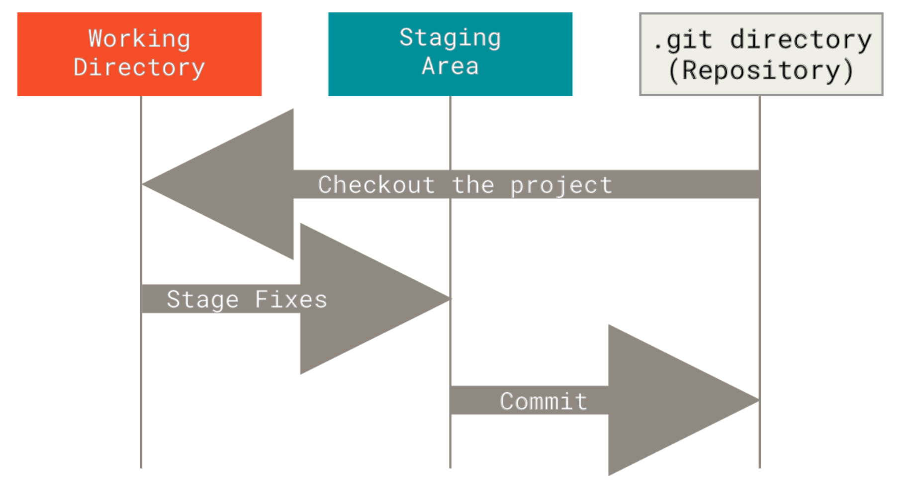

# Git
Version control so you don't lose your work to a mistake.

## Version control
"Version control" just means a system to keep track of the changes that happen to a file.
You might be used to just saving multiple versions of a file or folder (adding "_draft", "_v1", "_v2", "_final", "_final_final" etc. to the end of the names).

**Version control systems** are desgned to keep track of the history of a project without so much room for user error.
One example is built into e.g. Office 365 in terms of file history.

Version control systems based on a central server were developed for collaboration.
Users could "check out" files to work on, and send changes back to the master copy.
But this has the same risk that working on one computer does—if the server fails, everything is lost.

**Distributed version control** is a system where everyone keeps their own full cloned copy of the **repository** (the project files) and all the changes in its history.
Git is an open-source distributed version control system, designed with an emphasis on *non-linear* development (i.e. parallel branches, modelled on the parallel versions of the repository of each clone).

## The git repository
In a git repository, files are:
- **Modified**: altered from the last version, but not yet committed to the version control.
- **Staged**: marked as ready to be added to the next snapshot.
- **Committed**: stored and safe.

Once committing a version of a file to the repositiory, it is stored in the ".git directory"—a hidden folder storing versions and metadata inside the "working directory" (which is the repo folder on your computer).



## Setting up
Git needs to be installed—often this is already done (especially on linux systems), but instructions can be found in the [Git documentation](https://git-scm.com/book/en/v2/Getting-Started-Installing-Git).
The command line interface should be installed as part of this—it is the main way git will be described here, but VS Code also has a good graphical interface you can use too.

[`git config`](https://tldr.inbrowser.app/pages/common/git-config) lets you set configuration options.
Passing the `--global` flag sets the options across all repos for your user.

You need to set your identity before you make any commits, because this information is baked into all your snapshots:
```bash
git config --global user.name "Your Name"
git config --global user.email your.email@imperial.ac.uk
```
