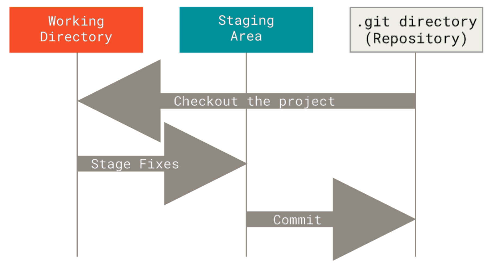

< [SSH and SCP](./3_2_SSH.md) | [Remotes and GitHub](./4_2_GitHub.md) >

# Git
Version control so you don't lose your work to a mistake.

## Version control
"Version control" just means a system to keep track of the changes that happen to a file.
You might be used to just saving multiple versions of a file or folder (adding "_draft", "_v1", "_v2", "_final", "_final_final" etc. to the end of the names).

**Version control systems** are desgned to keep track of the history of a project without so much room for user error.
One example is built into e.g. Office 365 in terms of file history.

Version control systems based on a central server were developed for collaboration.
Users could "check out" files to work on, and send changes back to the master copy.
But this has the same risk that working on one computer does—if the server fails, everything is lost.

**Distributed version control** is a system where everyone keeps their own full cloned copy of the **repository** (the project files) and all the changes in its history.
Git is an open-source distributed version control system, designed with an emphasis on *non-linear* development (i.e. parallel branches, modelled on the parallel versions of the repository of each clone).

## The git repository
In a git repository, files are:
- **Modified**: altered from the last version, but not yet committed to the version control.
- **Staged**: marked as ready to be added to the next snapshot.
- **Committed**: stored and safe—they return to an "**unmodified**" state in the working directory.
Other files in the directory, are **untracked**—not held in the snapshots.

Once committing a version of a file to the repositiory, it is stored in the ".git directory"—a hidden folder storing versions and metadata inside the "working directory" (which is the repo folder on your computer).
These parts of a git repository are plotted below (taken from Pro Git, chapter 1).


## Setting up
Git needs to be installed—often this is already done (especially on linux systems), but instructions can be found in the [Git documentation](https://git-scm.com/book/en/v2/Getting-Started-Installing-Git).
The command line interface should be installed as part of this—it is the main way git will be described here, but VS Code also has a good graphical interface you can use too.

[`git config`](https://tldr.inbrowser.app/pages/common/git-config) lets you set configuration options.
Passing the `--global` flag sets the options across all repos for your user.

You need to set your identity before you make any commits, because this information is baked into all your snapshots:
```bash
git config --global user.name "Your Name"
git config --global user.email your.email@imperial.ac.uk
```

## Basic usage
### Making a repo
You get a repo by using either:
- [`git init`](https://tldr.inbrowser.app/pages/common/git-init): turn an existing directory into a repo.
- [`git clone`](https://tldr.inbrowser.app/pages/common/git-clone): get a copy of a *remote* repo (e.g. one hosted on GitHub). You can clone from an https url (which is simplest) or using ssh.

Using `git clone` from a repo you make on GitHub is the easiest way to get your pushing and pulling ready to go.

### Tracking changes
Files in the directory are created as untracked, then you *add* them to the staging area.
You can also *stage* any modified files.
You can then *commit* your changes from the staging area to a new snapshot in the repo.
You should do this each time you make a meaningful change—a state you might want to go back to.


Commands to move files around in this way include:
- [`git status`](https://tldr.inbrowser.app/pages/common/git-status): view the status of files (will show changed and untracked files).
- [`git add`](https://tldr.inbrowser.app/pages/common/git-add): add changed/new files to the staging area. Note that this stages the **current version**, further changes need to be re-added.
- [`git commit`](https://tldr.inbrowser.app/pages/common/git-commit): make a commit (of the files in the staging area to a new snapshot). Add a commit message with the `-m` option (otherwise you will be prompted).
- [`git diff`](https://tldr.inbrowser.app/pages/common/git-diff): view the specific changes you've made.
- [`git rm`](https://tldr.inbrowser.app/pages/common/git-rm): remove (or just untrack) files from the repo.

Note: you can skip the staging area, and commit all changes to untracked files using `git commit -a`.

### Undoing things
Historic snapshots/commits can be viewed using [`git log`](https://tldr.inbrowser.app/pages/common/git-log).
This is hugely customisable (e.g. try `--oneline`).

`git commit --amend` can be used to fix mistakes in your last commit or last commit message (it will replace the commit to include changes that you've added to your staging area).
Dont bother trying to do this if you've pushed your changes elsewhere—it will get messy!

To revert changes you've made to the state they were in the previous commit, you can use [`git restore`](https://tldr.inbrowser.app/pages/common/git-restore).
By using the `--staged` flag, you can use the command to unstage your changes.
By using the `--source` flag, you can specify a different commit to restore from.

## More to learn...
There is a lot more to learn, especially about **branching** (a branch is a "pointer" which points to a specific snapshot).
This also leads you to **merge commits**—making snapshots that have more than one parent.

These, and more, are skills you'll come across but aren't vital for keeping track of your own work.

## Sources
The first few chapters of [Pro Git](https://git-scm.com/book/en/v2) were heaviliy used to write this section.

< [SSH and SCP](./3_2_SSH.md) | [Remotes and GitHub](./4_2_GitHub.md) >
