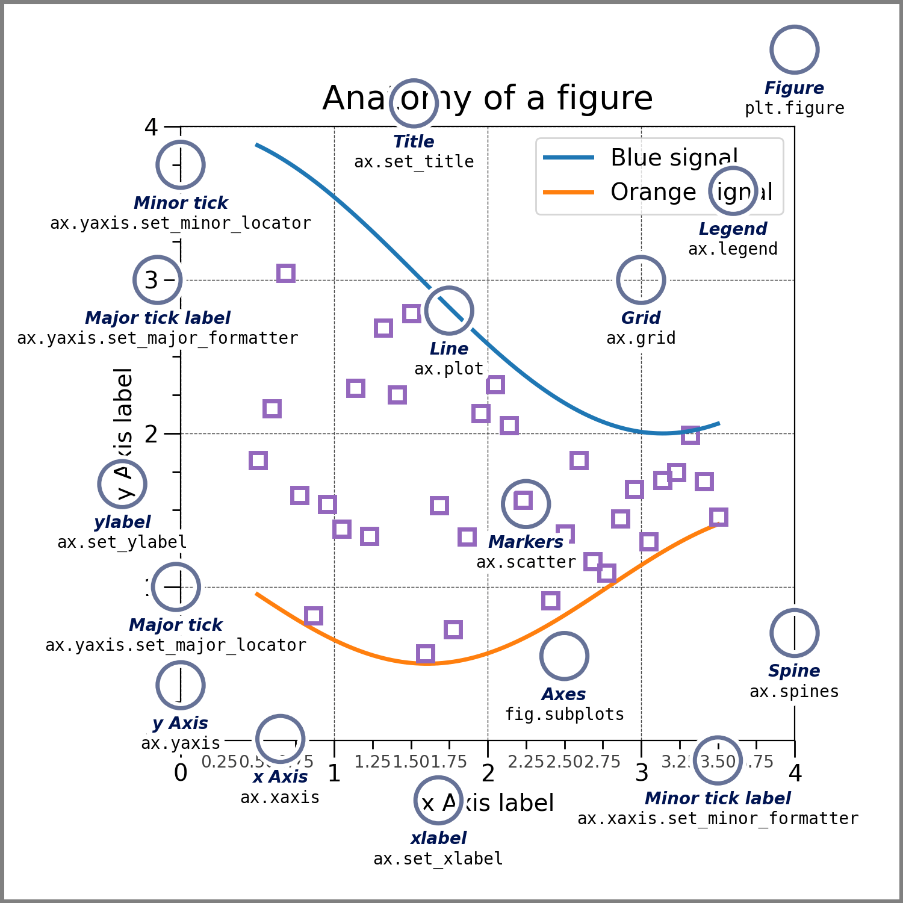

< [Using Python](./5_2_IPython.md) | [NetCDF Files](./6_1_NetCDF.md) >
# Python for Scientific Computing
Doing the work you need to do. 

## `numpy`: Data efficiency
Data (be it images, fields of variables, text, or audio files) can be represented as arrays of numbers.
Standard python doesn't handle data in the most efficient way—it's a high-level language (itself written in C).

Lists are the standard python way to store lots of data, but they are designed to be flexible (e.g. they can store lots of different data types in one object), and are implemented in a memory inefficient way.
Python has other object which are more efficient for storage, but they're not convenient to do maths or other operations with.

`numpy` provides "N-dimensional" rectangular arrays (`ndarray` instances) with a fixed size, containing data with a single type.
By enforcing these restrictions, they are handled much more efficiently than python lists, operations on arrays are also much more efficient than looping!

A warning: be careful that your arrays aren't "object" data type arrays, they contain python objects handled in that old inefficient way.
This can happen if you put strings, or the value `None` into an array. Use `np.nan` for missing numeric data.

Learn to use numpy using the [documentation](https://numpy.org/doc/stable/user/absolute_beginners.html).

## Pandas
Pandas builds on numpy, by structuring the data into tables called **DataFrames**, containing labelled columns called **Series**.

A pandas **Series** contrins a `values` property (the underlying numpy array) and an `index` property.
The `index` makes the implicit integer values labelling each value become explicit.
The series is a bit like a dictionary—it contains keys (in the index) and values.

The **DataArray** is a grouping of Series objects into a table (i.e. each series, or "column" is given a key too).
There is an `index` property like before, but now also a `columns` property.
Underlying data is still a numpy array, in the `values` property, so these are fairly efficient (like a numpy array).

Pandas is good with null values, converting `None` and `np.nan` to try to be efficient.
It also provides `.isnull()` and `.notnull()` operators to get boolean masks of the data.

Pandas arrays are flexible to use like spreadsheets or databases: they can be merged, joined, pivoted, and grouped based on their values.

## Dates and times
Working with dates and times can be messy in python.

There are basic objects from the standard library (the `datetime` package).
They're simple and good for performing operations, but they are inefficient for big arrays.

NumPy introduces the `datetime64` and `timedelta64` datatypes: they're efficient, but fiddly to use, requiring a specified precision and having limited time spans.

Pandas `Timestamp`, `Timedelta`, and `Period` data types are simple and maintain the efficiency of the numpy objects.

## Matplotlib
Basic plotting is provided by matplotlib, a cross-platform tool.
The plots are starting to look aged, but it is versatile and widely used.
The seaborn package is one "wrapper" that can spruce up its look and provide some basic analysis.

It has two different ways of interacting with it, either directly using `Figure` and `Axis` object, or using the `pyplot` wrapper (imported usually as `plt`).
The anatomy figure is shown below (from the Matplotlib documentation).

Basic plotting is done using `plt.plot` (or `ax.plot`).
`plt.scatter` is more versatile (it can vary the colour and size of points), but is much less efficient as a result.
`plt.errorbar` can do plotting with errors, and `plt.fill_between` can shade regions.

For three-dimensional data, `plt.contour` and `plt.imshow` are useful simple functions for contour plots and images respectively.
`plt.pcolormesh` is like an advanced `imshow`, where you can specify the grid (or x and y points) manually—it's useful for plotting data on maps when their projections are different.

`plt.hist` and `plt.hist2d` can be used to build a histogram of one- or two-dimensional data.
This can also be done manually, using `np.histogram` followed by `plt.imshow` or `plt.pcolormesh`.

Working with Matplotlib can be a faff.
You might wrestle with "GridSpecs" to line up your subplots with colourbars, or with "Artists" to get your legends working properly.
My best pieces of advice would be to let it make some of its own decisions (constrained and tight layouts, or subplot_mosaic can help), and try asking ChatGPT to help if you're trying to get something to work—it knows Matplotlib reasonably well.

## Other packages
- [`scipy`](https://docs.scipy.org/doc/scipy/tutorial/index.html#user-guide) for "mathematical convenience functions" for numpy. (Especially [`scipy.interpolate`](https://docs.scipy.org/doc/scipy/reference/interpolate.html) and [`scipy.ndimage`](https://docs.scipy.org/doc/scipy/reference/ndimage.html)
- [`seaborn`](https://seaborn.pydata.org/) for pretty graphs and stats exploration, deeply integrated with pandas.
- [`scikit-learn`] for machine learning from regression onwards (look up tensorflow to go beyond, or HuggingFace to explore transformer models).

## Sources
[NumPy Documentation](https://numpy.org/doc/stable/user/)
[Python data science handbook](https://jakevdp.github.io/PythonDataScienceHandbook/)
[Pandas](https://pandas.pydata.org/docs/)
[Matplotlib](https://matplotlib.org/stable/users/explain/quick_start.html)

< [Using Python](./5_2_IPython.md) | [NetCDF Files](./6_1_NetCDF.md) >
