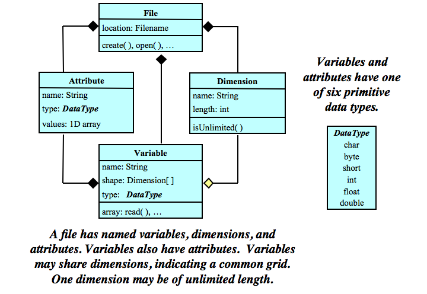

< [Python for Scientific Computing](./5_3_PythonScientificComputing.md) |

# NetCDF and XArray
Data files which describe themselves (and using them in python).

## What are NetCDF files
NetCDF (.nc) files are data formats which contain information about the data contained inside.
The files contain:
- **variables** stored in N-dimensional arrays, with a specified name and data type.
- **dimensions** describing the axes with a name and a length. The length can be "unlimited" which means the data can be extended in this direction (e.g. time).
- **attributes** which are small annotations with names. They "belong" either to the file as a whole or to a specific data variable.

Note that not every data variable has to use all the dimensions in a NetCDF file.
The basic structure is shown below.

### Example
You might have pressure and temperature data from model output (these would be variables, and each one could have attributes containing e.g. the units).
This would be data as a function of latitude, longitude, vertical level and time (these would be dimensions, with a length and a name).
By convention, you add **coordinate variables** which store the values along the axis. Each one would be a 1-D variable.

## XArray
XArray reporduces the NetCDF data structure in python.
It can also be used to seamlessly load and save data in NetCDF format.
We normally import xarray with the alias `xr`.

XArray also feels natural if you're familiar with pandas:
- Individual data variables are like columns in a pandas DataFrame (or pandas Series objects). A `DataArray` object represents each variable.
- The structure as a whole is a `Dataset`, its similar in purpose to the pandas DataFrame.

A quick overview of XArray can be found in [the documentation](https://docs.xarray.dev/en/stable/getting-started-guide/quick-overview.html).

## Sources
- [Unidata NetCDF documentation](https://docs.unidata.ucar.edu/netcdf-c/current/index.html)
- [XArray documentation](https://docs.xarray.dev/en/stable/)

< [Python for Scientific Computing](./5_3_PythonScientificComputing.md) |
